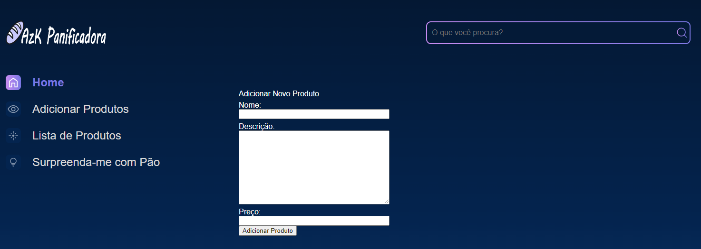

# Django - AzK Panificadora

- Mudamos a timezone e a linguagem do projeto fazendo alterações no arquivo settings.py;
- Aumentamos a segurança do projeto protegendo a SECRET_KEY e instalando o pacote python-dotenv e criando o arquivo .env;

- Subimos o projeto para um repositório remoto no github e tomamos o cuidado de criar o arquivo .gitignore para não deixarmos vulneráveis dados sensíveis do nosso projeto.

- Primeiros passos para criação da página utilizando o Django
- Página Inicial da Panificadora

- Ajustes de responsabilidade do setup e redirecionamento de rotas para Inicio -> Setup
- Ajustes dos arquivos estáticos para imports das necessidades do nosso projeto

- Criação do arquivo requeriments.txt, para download de dependências com suas necessidades

- Implementação de imagens estáticas
- Planejamento de layout do site e possiveis imagens
- Ajustes de logos
- Ajustes para duplicidade de códigos, utilizando block content e endblock
- Ajustes de páginas para reaproveitamento de código de desenvolvimento, utilizando include
    *_header
    *_rodape
    *_menu-lateral : OBS: Travamento no momento para criar uma section para evitar duplicidade de código

- Criação de nova página para compra de novos produtos

- Criação de nova página para inserção de novos produtos para venda

Banco de dados:

Endpoints atuais:
